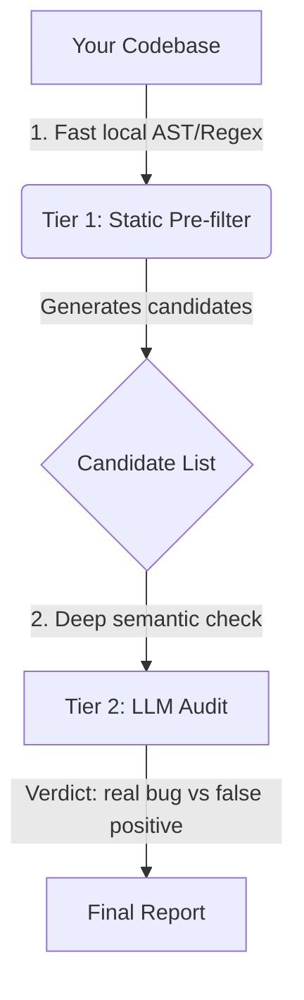

# 🧹 Codebase Hygiene Suite

> **Not slop. This is a production-grade technical debt scanner.**

> **Related docs:** `GUIDE.md` (install & configure) · `FAQ.md` (troubleshooting & cost) · `orchestrator_hygiene.md` (CI orchestration)

This is a **hybrid static-analysis + LLM-audit pipeline** that detects real bugs — swallowed exceptions, schema hazards, circular imports, hardcoded secrets, async deadlocks, and more — across any Python codebase.

## What problem does this solve?

Most "linters" either:
- **False-positive everything** (pylint: 1000 warnings, 990 are junk)
- **Miss real bugs** (you ship code with `except: pass` that silently drops user data)

This suite uses a **two-tier pipeline** to eliminate both problems:



**Tier 1** runs in milliseconds — pure Python AST analysis, no API calls. It casts a wide net (high recall), flagging every suspicious pattern.

**Tier 2** invokes a Pydantic-AI agent **only** on the candidates. The LLM examines the actual code context (snippet only, not your whole repo) and makes a semantic call: `SILENT_KILLER` vs `FALSE_POSITIVE`, `SCHEMA_HAZARD` vs `safe_dict_use`, etc.

This means you pay for **3–5 API calls per scan** (not thousands), and you get **zero false positives** worth your time.

## What does it find?

| # | Scanner | Detects | Tier | LLM? |
|---|---|---|---|---|
| 1 | `find_dead_code.py` | Unused classes/functions unreachable via import graph | Tier 2 | ✓ |
| 2 | `find_silent_killers.py` | `except: pass`, bare `except:`, silent fallback configs | Tier 2 | ✓ |
| 3 | `find_async_hazards.py` | `requests.get()` inside `async def`, blocking I/O in event loop | Tier 2 | ✓ |
| 4 | `find_engine_schemas.py` | Raw `dict`/`list` passed to Pydantic models (runtime crash risk) | Tier 2 | ✓ |
| 5 | `find_secrets.py` | Hardcoded API keys, tokens, passwords committed to source | Tier 2 | ✓ |
| 6 | `find_env_drift.py` | `os.getenv()` keys missing from `.env.example` | Tier 2 | ✓ |
| 7 | `find_circular_deps.py` | Import cycles that can cause `ImportError` at startup | Tier 2 | ✓ |
| 8 | `find_duplication.py` | Copy-pasted code blocks > N lines (maintenance debt) | Tier 2 | ✓ |
| 9 | `find_type_safety.py` | `mypy`/pyright errors filtered by LLM for false positives | Tier 2 | ✓ |
| 10 | `find_registry_clashes.py` | `.get()`, `.keys()`, `in` on Pydantic models (post-migration crash risk) | Tier 2 | ✓ |
| 11 | `find_message_drift.py` | Telegram translation keys in code vs `messages.yaml` | Tier 1 | ✗ |

Plus two meta-tools:
- `find_cc_nested.py` — cyclomatic complexity analysis (run separately)
- `kill_tries.py` — batch LLM refactoring of high-CC functions (see `GUIDE.md` for orchestration)

## Directory Structure

```
hygiene/
├── .env.example          # All config knobs (copy to .env, never commit .env)
├── README.md             # This file — what it is, why it exists
├── GUIDE.md              # How to install, configure, and run on your repo
├── FAQ.md                # Troubleshooting, cost, CI/CD, and model configuration
├── control.py            # Runtime settings loader (reads KIT_* env vars)
├── requirements.txt      # Python deps for full mode
├── run-registry-scan.sh  # tmux wrapper for long-running registry scans
├── cleanup.py            # One-shot AST auto-fixer for simple violations
├── scanners/
│   ├── run_all.py        # Master runner — runs all 11 scanners in sequence
│   ├── utils.py          # Shared helpers (file discovery, path validation)
│   └── find_*.py         # Individual scanners (see table above)
└── reports/              # Generated audit outputs (JSON + MD per scanner)
```

## No vendor lock-in

- **No external services required** — Tier 1 runs 100% offline
- **Bring your own LLM** — configure `KIT_BASE_URL` / `KIT_API_KEY` / `KIT_MODEL` in `.env`
- **Works on any Python repo** — set `TARGET_ROOT` to your codebase, point the scanners at any `src/` directory

---

## Quick Start (30 seconds)

```bash
# 1. Copy config and point at your repo
cp hygiene/.env.example hygiene/.env
# Edit .env: set TARGET_ROOT=/path/to/your/code

# 2. Install deps (if running LLM tiers)
pip install -r hygiene/requirements.txt

# 3. Run -- offline static pass only (no API key needed)
uv run hygiene/scanners/run_all.py --scripts

# 4. Review reports in hygiene/reports/
```

See **[GUIDE.md](./GUIDE.md)** for full installation, LLM configuration, and advanced usage.  
Common questions answered in **[FAQ.md](./FAQ.md)**.
