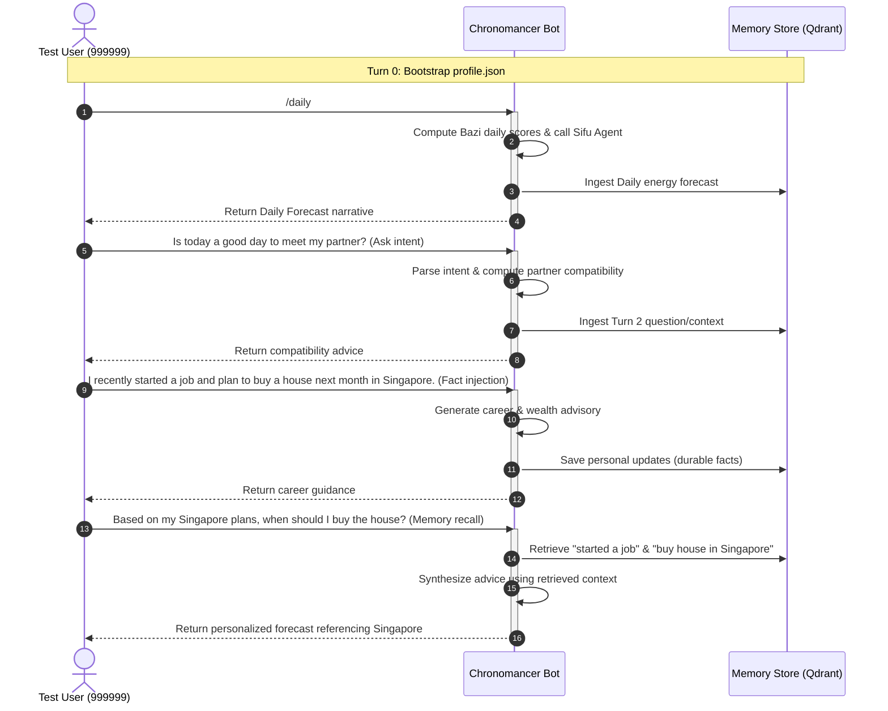

# Chronomancer Daily & Conversational Ask Testing

This suite validates the `/daily` forecast execution, conversational `/ask` logic, and memory store state tracking in a sequential, multi-turn conversation.

---

## 1. Prerequisites & Preflight Checklist

Before starting, verify the local backend services are active:

| Service / Dependency | Check Method | Expected State |
| :--- | :--- | :--- |
| 👤 **User Profile / Report** | Check `_prd/users/999/reports/` | A valid monthly master JSON or `profile.json` must exist. |
| 🧠 **Memory Store (Qdrant)** | GET `http://127.0.0.1:6333/collections/user_memory` | Qdrant is online and the `user_memory` collection has a dimension of `1024`. |
| 🔢 **Embedding Engine (BGEM3)** | POST `http://10.32.34.109:8000/embed` | local BGEM3 server is online and generating 1024-dim vectors. |
| 🔮 **LLM Gateway (Sifu / Simplifier)** | POST `http://10.32.34.243:18000/v1/chat/completions` | `gemma-4-31b-it` is active and has quota. |
| 🤝 **BaziRAG (for /ask)** | GET `http://10.32.34.243:9000/sse` | BaziRAG MCP server is online. |

---

## 2. Multi-Turn Conversational Simulation Plan

The automated test script (`test.py`) executes a sequential, multi-turn conversation simulating a real user interaction:

### Verification Criteria
For each turn in the simulation, the test asserts:
* **Turn 1 (/daily)**: Verifies the daily cached forecast is successfully generated. Verifies memory is stored.
* **Turn 2 (Partner Ask)**: Verifies target dates and stakeholder contexts are successfully resolved.
* **Turn 3 (Fact Injection)**: Verifies the durable facts (job, house in Singapore) are stored in the memory vector database.
* **Turn 4 (Recall)**: Verifies the response correctly refers to Singapore and the house plans by extracting and using those facts from Qdrant.
* **State Verification**: Asserts that `session.step` remains in `CHRONOMANCER` during all conversational follow-ups.
