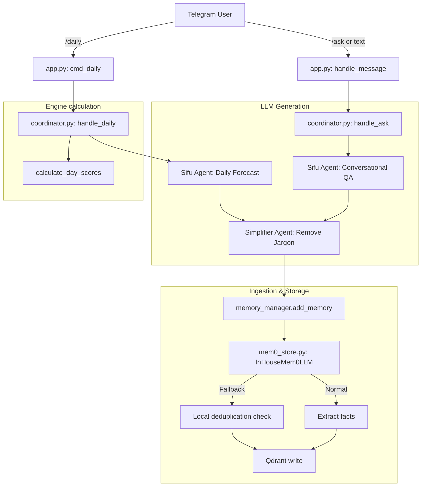

# Execution Path Trace - Daily & Ask Flows

This document details the code path, imports, and sequence of execution for `/daily` and `/ask` operations.



---

## 1. Daily Forecast Path

* **Telegram Entrypoint**: `src2/interfaces/telegram/app.py`
  - Command `/daily` maps to the inner handler executing:
    ```python
    from .chronomancer import handle_daily
    reply = await handle_daily(chat_id)
    ```
* **Chronomancer Coordinator**: `src2/interfaces/telegram/chronomancer/coordinator.py#handle_daily`
  - Reconstructs profile from `profile.json` or monthly master JSONs using `_reconstruct_session_profile`.
  - Calculates daily scoring via `src2/engine/activity_oracle.py#score_day`.
  - Sends context to **Sifu Agent** (`src2/interfaces/telegram/chronomancer/agents.py`) for forecast narrative.
  - Sends narrative to **Simplifier Agent** to strip Bazi jargon if sifu-mode is disabled.
  - Saves the generated summary in `memory_manager.add_memory`.
  - Caches forecast in Valkey/SQLite database using `db.save_chrono_cache`.

---

## 2. Chronomancer Ask Path

* **Telegram Entrypoint**: `src2/interfaces/telegram/app.py`
  - `/ask <question>` command or any free-text while in `CHRONOMANCER` step executes:
    ```python
    from .chronomancer import handle_ask
    reply = await handle_ask(chat_id, question)
    ```
* **Chronomancer Coordinator**: `src2/interfaces/telegram/chronomancer/coordinator.py#handle_ask`
  - Calls `src2/interfaces/telegram/ier_parser.py#parse_question` to determine dates, intent, and entities.
  - Scores target dates for the user.
  - Fetches and scores stakeholder charts if questions are related to a partner or stakeholder.
  - Calls the **Sifu Agent** to answer the question with the scored date context.
  - Saves the question and response context in `memory_manager.add_memory`.

---

## 3. UAT E2E Simulation Flow (test.py)

The UAT script [`test.py`](file:///home/yapilwsl/arthityap/baziforecaster/[baziforecaster-only: TEST/GOLD/05_Chronomancer/test.py not in kit download]) walks through the following sequential conversational path using the official tester ID `999` and real RAG/LLM calls:

* **Turn 0: Bootstrapping**:
  - Initializes session for user `999` and dynamically seeds `semantic_id` as `SGUSD0000999` at database creation.
  - Deletes any old database data and clears vector memories in Qdrant.
  - Saves Test Profile's Bazi profile to disk and session storage.

* **Turn 1: Language Preference Selection (`/lang`)**:
  - Simulates the `/lang` command where the user selects Chinese (`CN`).
  - Sets the preferred language in the database preferences to `"Chinese"` and disables Sifu Mode (`sifu_mode=0`).

* **Turn 2: Daily Forecast Ingestion (`/daily`)**:
  - Calls `handle_daily(user_id)` to compute transits and generate the initial daily narrative in Chinese.
  - Verifies that the computed Chinese narrative is saved in the database cache.

* **Turn 2b: Cache Extraction Validation**:
  - Calls `handle_daily(user_id)` again and asserts that the returned Chinese narrative is fetched instantly from the database cache and matches Turn 2 exactly.

* **Turn 3: Follow-up QA**:
  - User asks `"Is today a good day to meet my partner?"`.
  - The system parses the question intent, checks compatibility, and responds in Chinese.

* **Turn 4: Fact Ingestion**:
  - User shares `"I recently started a new job as a Senior Engineer, and I am planning to buy a house next month in Singapore."`.
  - The system extracts and ingests these facts in Chinese.

* **Turn 5: Context Recall QA**:
  - User asks `"Based on my Singapore plans, what should I look out for?"`.
  - The system queries Qdrant under `SGUSD0000999`, retrieves the career/housing memory, and synthesizes a response in Chinese.

* **Turn 6: Final Cache Verification**:
  - Calls `handle_daily(user_id)` at the end of the conversation.
  - Verifies that the Chinese daily forecast is retrieved instantly from the database cache, matching Turn 2 exactly.
